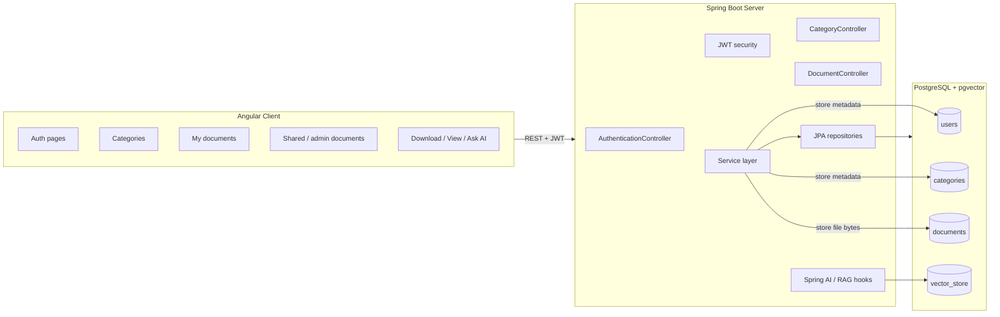

# AI Powered Document Companion - using Spring AI and RAG

My Companion is a full-stack document companion app for organizing notes, uploading files, and preparing for AI-assisted retrieval with RAG.

It is split into two parts:

- **`server/`** — Spring Boot REST API, JWT authentication, PostgreSQL, Flyway, and pgvector-backed AI retrieval
- **`client/`** — Angular frontend with NgRx state management and document/category screens

> This repository root currently contains the backend project in `server/`. If you also keep the Angular app in a sibling `client/` folder, the architecture below still applies.

## What the app does

- Register and log in users with **JWT authentication**
- Support **USER** and **ADMIN** roles
- Create unique **categories/topics** such as Physics, DSA, etc.
- Upload documents into categories
- Limit documents per category to **10**
- Store uploaded files in PostgreSQL as `bytea`
- Auto-populate `createdAt` on `User`, `Category`, and `Document`
- List:
  - my categories
  - my documents
  - all documents
  - admin-uploaded documents for user-facing shared content
- Download and view uploaded documents
- Prepare document chunks for **RAG** / semantic retrieval with **pgvector**

## Architecture



## Backend overview

### Main packages

- `controller/` — REST endpoints for auth, categories, and documents
- `service/` — business logic
- `service/impl/` — service implementations
- `repository/` — Spring Data JPA repositories
- `model/` — JPA entities such as `User`, `Category`, and `UserDocument`
- `dto/` — request/response objects
- `security/` — JWT and authentication support
- `config/` — application and AI configuration
- `util/` — helper classes like auth utilities and constants
- `exceptions/` — API error handling

### Key API areas

- `POST /api/v1/companion/auth/register`
- `POST /api/v1/companion/auth/login`
- `POST /api/v1/companion/categories`
- `GET /api/v1/companion/categories/mine`
- `POST /api/v1/companion/documents/upload/{categoryId}`
- `GET /api/v1/companion/documents/mine/{categoryId}`
- `GET /api/v1/companion/documents/all`
- `GET /api/v1/companion/documents/admin`
- `GET /api/v1/companion/documents/download/{id}`
- `GET /api/v1/companion/documents/view/{id}`
- `POST /api/v1/companion/documents/ask-ai`

## Database tables

After startup, the app should create or manage these core tables:

- `users`
- `categories`
- `documents`
- `vector_store` (managed by Spring AI pgvector integration)
- Flyway tables such as `flyway_schema_history`

## Prerequisites

- Java 25
- Maven 3.9+
- PostgreSQL 17 with pgvector, or the provided Docker image
- Node.js + Angular CLI for the client

## Run PostgreSQL locally

A ready-to-use PostgreSQL + pgvector setup is included:

```bash
cd server
docker compose up -d
```

The default database settings are:

- database: `my_doc_companion`
- username: `postgres`
- password: `postgres`
- host: `localhost:5432`

## Environment variables

Backend:

- `SPRING_DATASOURCE_URL`
- `SPRING_DATASOURCE_USERNAME`
- `SPRING_DATASOURCE_PASSWORD`
- `MYCOMPANION_JWT_SECRET`
- `MYCOMPANION_REFRESH_TOKEN_SECRET`
- `GEMINI_API_KEY`

If you use a different Spring AI model, update the AI config and dependencies accordingly.

## Run the backend

From `server/`:

```bash
./mvnw spring-boot:run
```

On Windows PowerShell:

```powershell
.\mvnw.cmd spring-boot:run
```

## Run the client

If your Angular app is in a sibling `client/` folder, run it from there:

```bash
npm install
npm start
```

The frontend typically talks to the backend through the configured API base URL in its environment files.

## Authentication flow

1. Register a user
2. Log in to receive a JWT
3. Send the JWT in the `Authorization: Bearer <token>` header
4. Use protected endpoints for categories and documents

## Document upload notes

- Uploads use multipart form data
- The file field name is `file`
- Allowed file types currently include:
  - PDF
  - DOC
  - DOCX
- Files are stored directly in PostgreSQL in the `documents.data` column

## Shared documents behavior

The app supports separate document views for:

- **owned documents**
- **admin-uploaded shared documents**
- **all documents** for broad visibility where applicable

This fits the frontend pattern where shared admin content is shown in a separate tab.

## RAG / AI notes

The project is already structured for RAG:

- uploaded files are parsed into chunks
- chunks are stored in a vector store backed by pgvector
- similarity search is used to retrieve relevant context
- the AI layer formats an answer from retrieved chunks

The current implementation is a good base for adding better retrieval, citations, and prompt control later.

## Troubleshooting

### `no database settings found`

Make sure PostgreSQL is running and the datasource properties are set in `application.yaml` or through environment variables.

### `type "blob" does not exist`

Use PostgreSQL-friendly LOB handling. The project maps document bytes as `bytea`.

### `ChatClient.Builder bean not found`

This usually means the Spring AI model dependency or configuration is incomplete. Make sure your Gemini AI starter is configured and the API key is available.

### `403 Forbidden` on auth endpoints

Check that the public endpoint patterns in the security constants match the actual auth routes and that the JWT filter is not blocking register/login requests.

## Helpful files

- `HELP.md`
- `docker-compose.yml`
- `pom.xml`
- `src/main/resources/application.yaml`
- `src/main/java/app/companion/paudel/model/`
- `src/main/java/app/companion/paudel/controller/`

## Few Enhancements to consider

Good follow-up improvements for the project:

- replace the temporary AI config with a concrete Gemini chat/embedding setup
- add a file storage abstraction if documents should later move out of the database
- add pagination-aware UI tabs for owned vs shared documents
- add tests for upload/download/security routes
